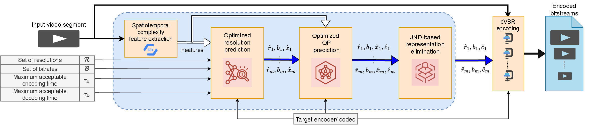

# Index

## Introduction

Traditional per-title encoding schemes aim to optimize encoding resolutions to deliver the highest perceptual quality for each representation. However, the traditionally used VMAF measure needs to be revised to determine the perceptual quality of VVC-coded bitstreams. XPSNR is observed to correlate better with the subjective quality of VVC-coded bitstreams. Towards this realization, we predict the average XPSNR of VVC-coded bitstreams using spatiotemporal complexity features of the video and the target encoding configuration using an XGBoost-based model. Based on the predicted XPSNR scores, we introduce a Quality-Aware Dynamic Resolution Adaptation (QADRA) framework for adaptive video streaming applications, where we determine the convex-hull online. Furthermore, keeping the encoding and decoding times within an acceptable threshold is mandatory for smooth and energy-efficient streaming. Hence, QADRA determines the encoding resolution for each target bitrate by maximizing XPSNR while constraining the maximum encoding or decoding time below a threshold.

## About QADRA

The primary objective of QADRA is a cVBR encoding scheme with a content-adaptive, JND-aware, online bitrate ladder prediction optimized for adaptive streaming applications.
The set of supported resolutions, target bitrates, the maximum acceptable encoding or decoding latency, the maximum quality level, and the target JND are considered inputs to the scheme.
Moreover, the encoder/codec is input to the scheme to generate the bitrate ladder for the corresponding codec configuration.
Based on the video complexity features (extracted by VCA) and the input parameters, bitrate-resolution-qp triples are predicted.
The adjacent points of the bitrate ladder are envisioned to have a perceptual quality difference of one JND.
Although reducing the overall encoding or decoding energy consumption and storage needed to store the bitrate ladder representations, QADRA is expected to improve the overall compression efficiency of the bitrate ladder encoding.

QADRA is available as an open-source Python-based framework published under the GPLv3 license.

 - [CLI options](cli.md)

 
